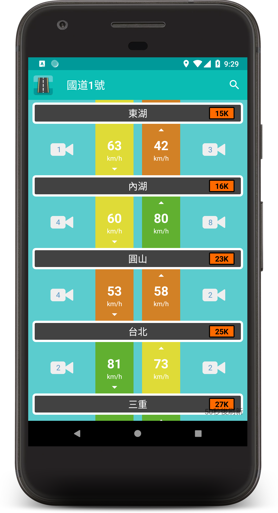
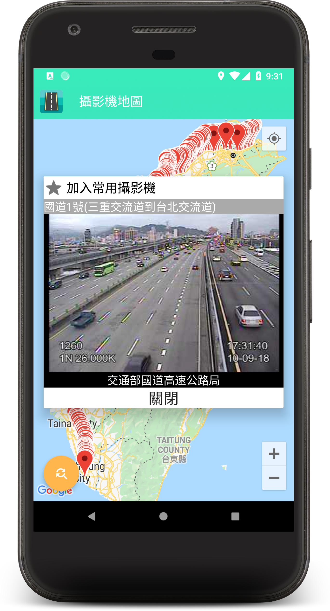
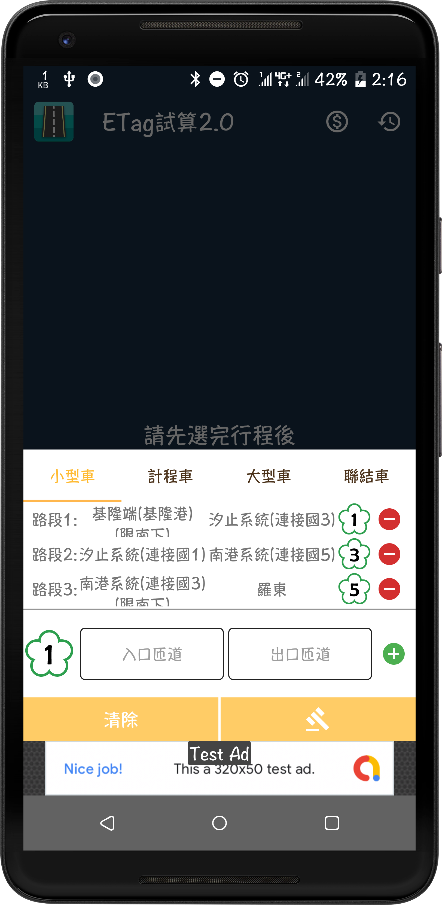
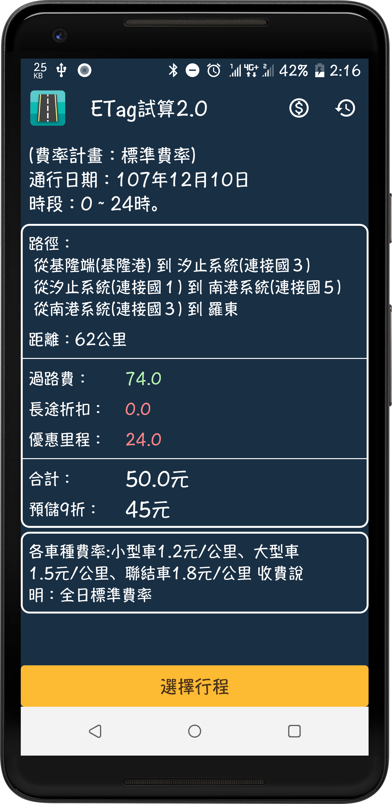
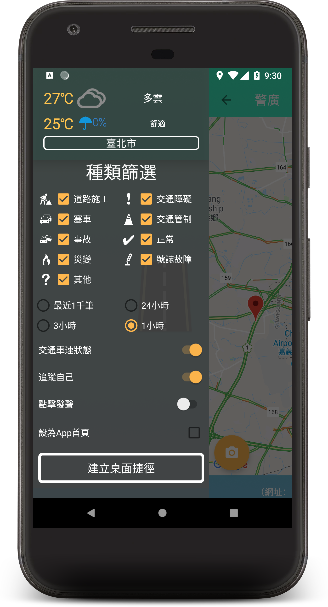
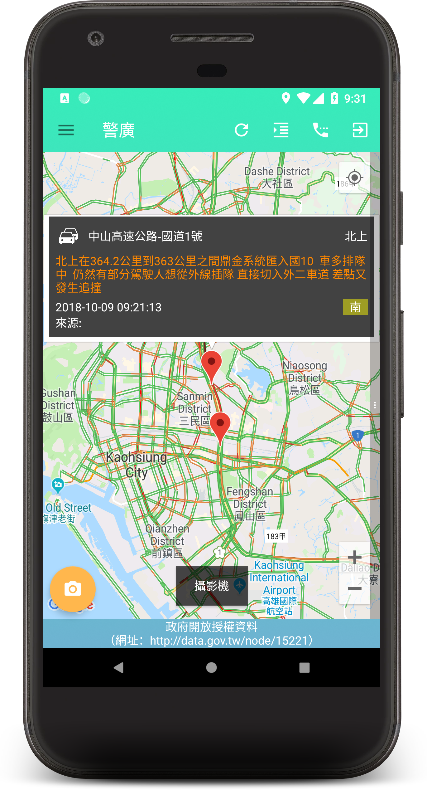
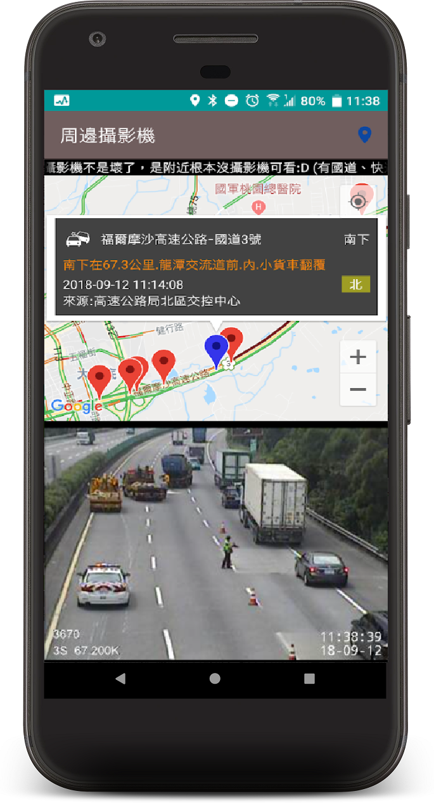
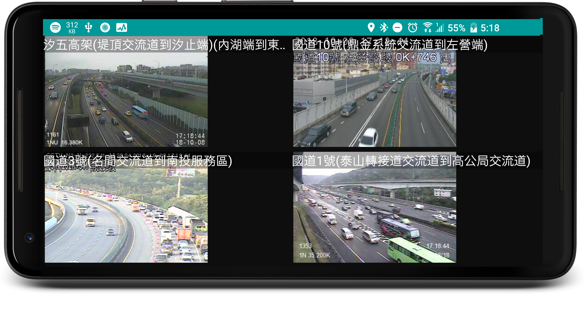

# 警廣即時報_Kotlin版
<a href='https://play.google.com/store/apps/details?id=tw.myself.oceanlin.newsbroadcast'></a>

《 警廣即時報 》提供您最快速、最正確的路況播報。讓您在行駛於道路上有最新的警廣資訊，免於開車時還需分心聽廣播，甚至遇到想聽音樂又想知道路況的窘境。除此之外，搭乘公共交通工具上班時遇上塞車無可奈何時，也能使用警廣即時報App準確了解前方狀況，並快照備份，讓您有個好交代!

警廣路況
－提供使用者警廣資料，方便查閱及記錄。

即時影像
- 提供使用者攝影機影像(CCTV)，即時觀看。

廣播電台
- 提供使用者收聽電台，開車也不Lose資訊。

匝道塞車
- 根據政府提供的匝道排隊預估時間，呈現給您。

氣候狀況
- 提供中央氣象局資料，方便使用者。

etag試算
- 提供使用者快速試算國道過路費(etc、etag)。

油價
- 提供最即時的油價。

行程規劃
- 提供使用者選進出匝道快速查看預估時間&距離&事件&車速。

常用攝影機
-使用者能儲存最常使用的攝影機同時觀看。

※Android6.0以上需授權所需權限
※開車時駕駛請勿使用APP，以免發生危險！！

資料來源：
政府資料開放平臺（網址：http://data.gov.tw/node/15221）
中央氣象局
高速公路總局

#警廣 #國道 #CCTV #路況 #廣播 #攝影機 #電台 #加油 #油價 #天氣 #交通 #行程 #匝道 #公路 #省道 #影像 #ETC #ETAG #過路費

畫面
 ------
  

  

  



### License
```
Copyright 2018 zih-yang lin

Licensed under the Apache License, Version 2.0 (the "License");
you may not use this file except in compliance with the License.
You may obtain a copy of the License at

   http://www.apache.org/licenses/LICENSE-2.0

Unless required by applicable law or agreed to in writing, software
distributed under the License is distributed on an "AS IS" BASIS,
WITHOUT WARRANTIES OR CONDITIONS OF ANY KIND, either express or implied.
See the License for the specific language governing permissions and
limitations under the License.
```
