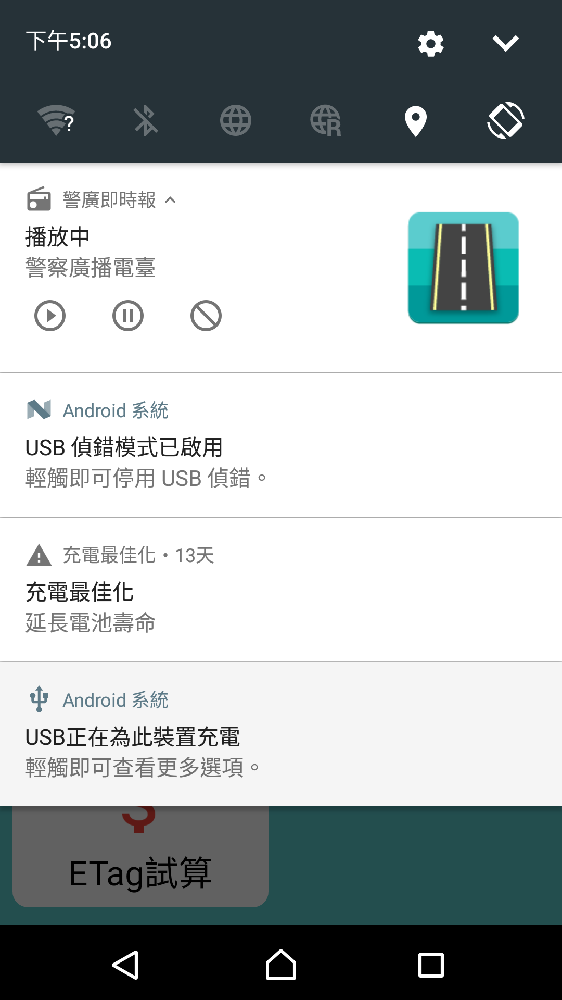
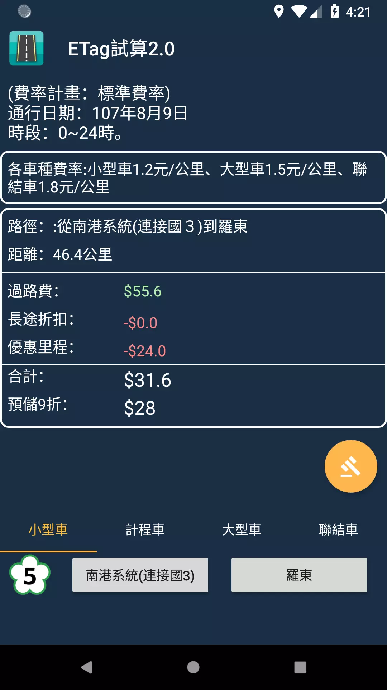

# 警廣即時報_Kotlin版
<a href='https://play.google.com/store/apps/details?id=tw.myself.oceanlin.newsbroadcast'></a>

警廣即時報提供您最快速、最正確的路況播報。讓您在行駛於道路上有最新的警廣資訊，免於開車時還需分心聽廣播，甚至遇到想聽音樂又想知道路況的窘境。除此之外，搭乘公共交通工具上班時遇上塞車無可奈何時，也能使用警廣即時報App準確了解前方狀況，並快照備份，讓您有個好交代!

警廣路況
－提供使用者警廣資料，方便查閱及記錄。

即時影像
- 提供使用者攝影機影像，即時觀看。

廣播電台
- 提供使用者收聽電台，開車也不Lose資訊。

公路車速圖
- 提供使用者快速查看塞車路段。

氣候狀況
- 提供中央氣象局資料，方便使用者。

etag試算
- 提供使用者快速試算國道過路費(etc、etag)。

畫面
 ------
  

  

  

 

### License
```
Copyright 2018 zih-yang lin

Licensed under the Apache License, Version 2.0 (the "License");
you may not use this file except in compliance with the License.
You may obtain a copy of the License at

   http://www.apache.org/licenses/LICENSE-2.0

Unless required by applicable law or agreed to in writing, software
distributed under the License is distributed on an "AS IS" BASIS,
WITHOUT WARRANTIES OR CONDITIONS OF ANY KIND, either express or implied.
See the License for the specific language governing permissions and
limitations under the License.
```
